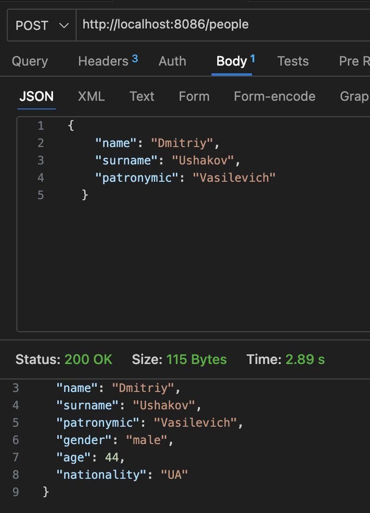
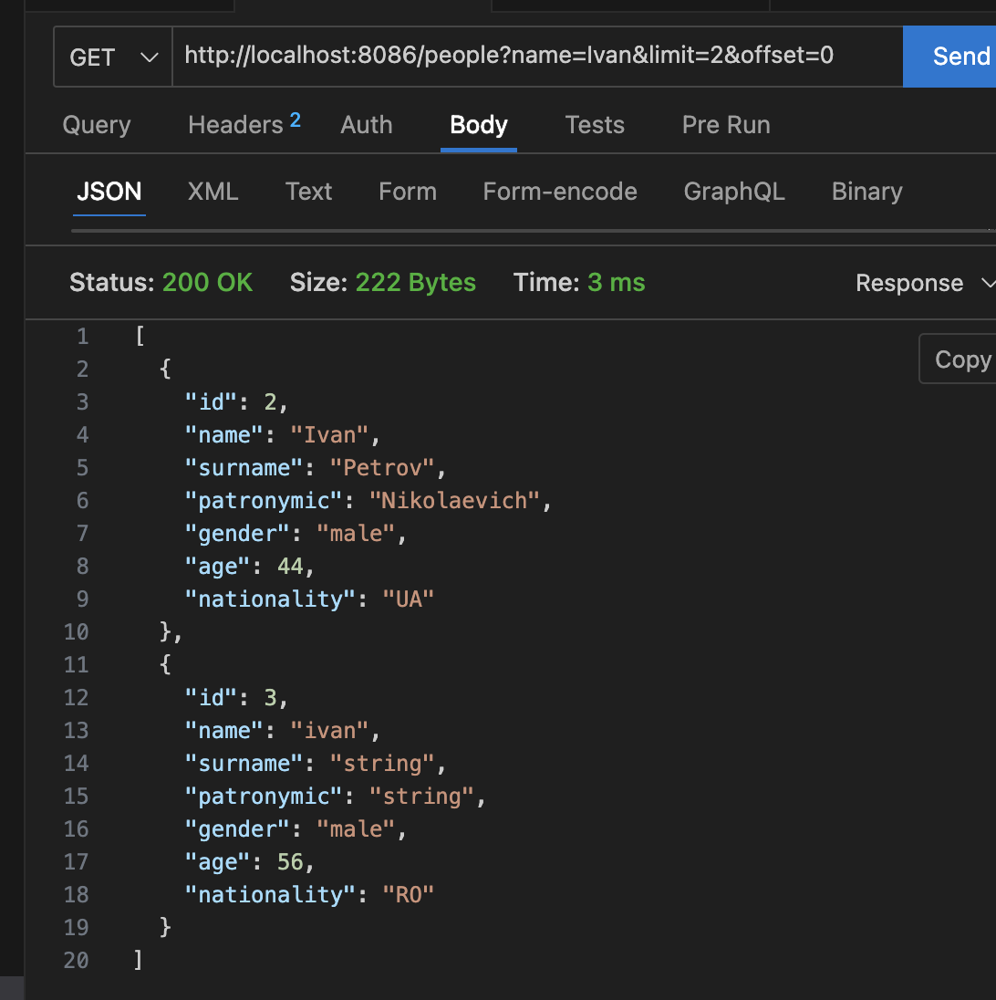
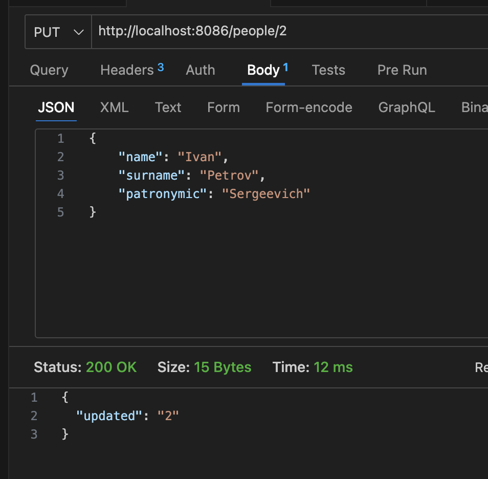
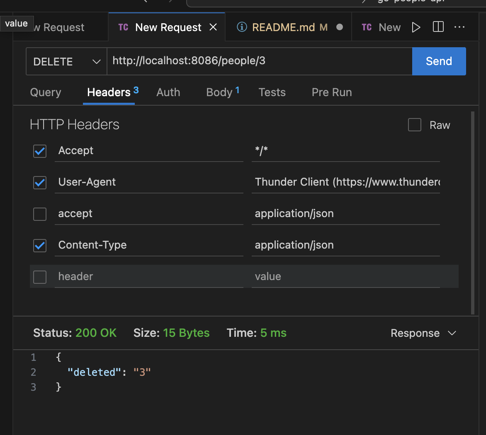
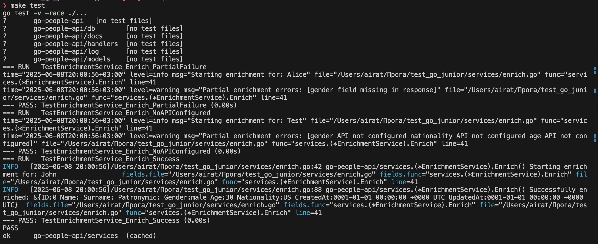
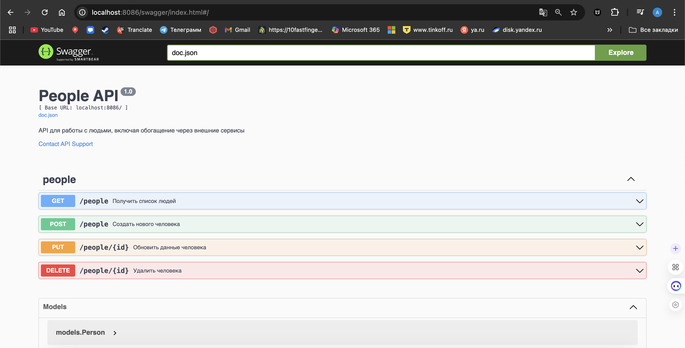
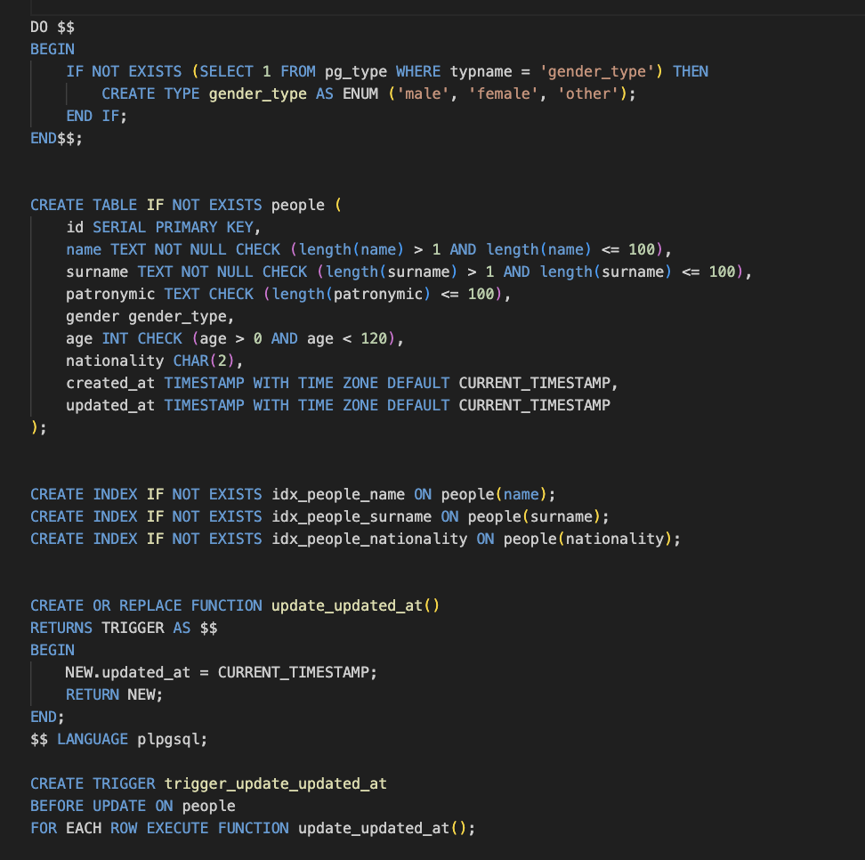
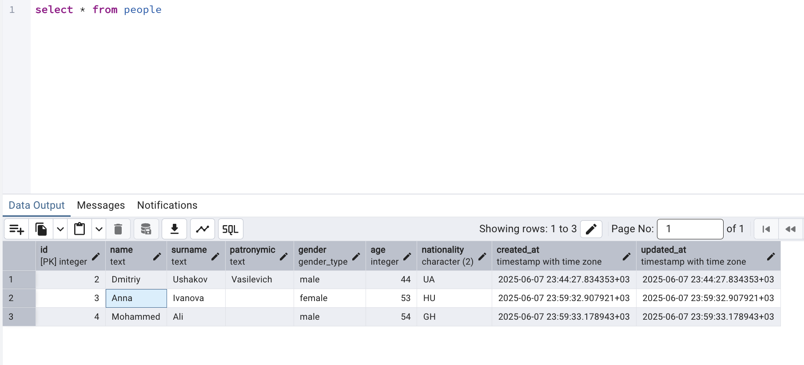

# 👤 People Enrichment API

REST-сервис на Go для приёма ФИО, обогащения через внешние API (возраст, пол, национальность) и сохранения в PostgreSQL.

---

## 🚀 Запуск проекта

go run main.go
Сервер поднимается по адресу: http://localhost:8086

🧩 Используемые API для обогащения
Тип	Сервис
Возраст	agify.io
Пол	genderize.io
Национальность	nationalize.io

---
## 🧪 Примеры REST-запросов 

### ✅ Добавление нового человека
POST /people

Пример запроса:

curl -X POST http://localhost:8086/people \
  -H "Content-Type: application/json" \
  -d '{
    "name": "Dmitriy",
    "surname": "Ushakov",
    "patronymic": "Vasilevich"
  }'

### 📄 Получение списка людей
GET /people

http://localhost:8086/people?name=Ivan&limit=2&offset=0

### ✏️ Обновление данных человека
PUT /people/:id

Пример запроса:
curl -X PUT http://localhost:8086/people/1 \
  -H "Content-Type: application/json" \
  -d '{
    "name": "Ivan",
    "surname": "Petrov",
    "patronymic": "Sergeevich"
  }'

### ❌ Удаление человека
DELETE /people/:id

Пример запроса:
curl -X DELETE http://localhost:8086/people/1
📸 Скриншот Postman: удаление

## ⚙️ Переменные окружения .env
env

Копировать код
DB_HOST=localhost
DB_PORT=5432
DB_USER=postgres
DB_PASSWORD=postgres
DB_NAME=people

## 🧪 Тестирование

make test

📸 Галерея скриншотов 
✅ POST /people — добавление нового человека
✅ GET /people — получение списка с фильтрами и пагинацией
✅ PUT /people/:id — изменение данных
✅ DELETE /people/:id — удаление записи
✅ Обогащённый JSON-ответ
✅ Скриншот из Postman или cURL
## 📚 Swagger-документация
Swagger будет доступен по адресу:

http://localhost:8086/swagger/index.html

---

## 🗄️ База данных

📦 Проект использует PostgreSQL для хранения обогащённых данных о людях.

### 🔍 Структура таблицы

Ниже представлены скриншоты структуры базы данных, созданной с помощью миграций:

📸 _Скриншот 1: Таблица `people` — общая структура_

📸 _Скриншот 2: Типы и ограничения колонок_

📸 _Скриншот 3: Представление записей в таблице_

## 📌 Автор

Контакты: airat.sharushev@gmail.com
тг @AiratSharushev